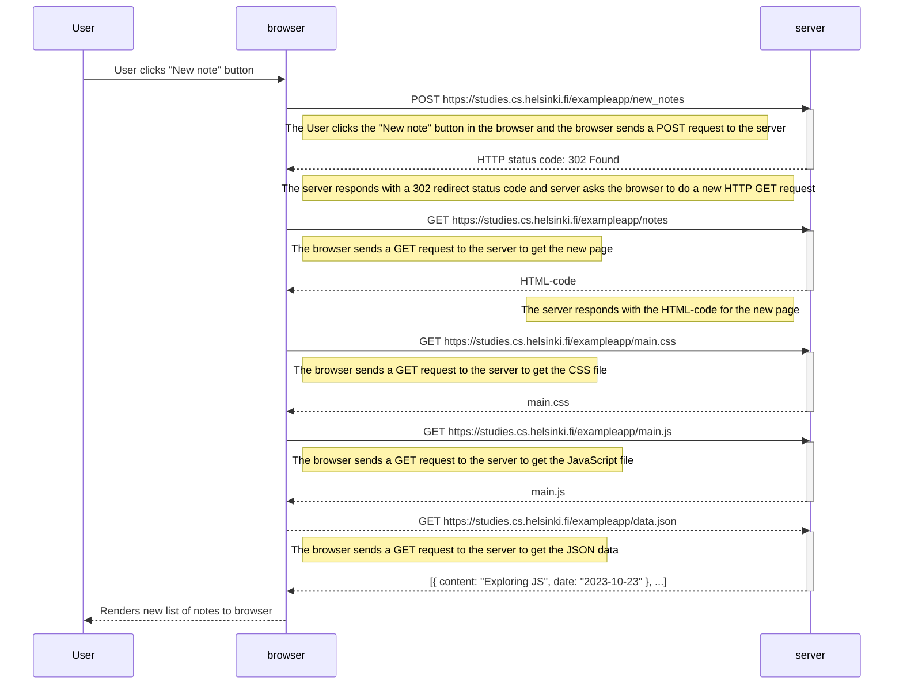

```mermaid
sequenceDiagram
    participant User
    participant browser
    participant server

    User->>browser: User clicks "New note" button
    browser->>server: POST https://studies.cs.helsinki.fi/exampleapp/new_notes
    activate server
    Note right of browser: The User clicks the "New note" button in the browser and the browser sends a POST request to the server
    server-->>browser: HTTP status code: 302 Found
    deactivate server
    Note left of server: The server responds with a 302 redirect status code and server asks the browser to do a new HTTP GET request

    browser->>server: GET https://studies.cs.helsinki.fi/exampleapp/notes
    activate server
    Note right of browser: The browser sends a GET request to the server to get the new page
    server-->>browser: HTML-code
    deactivate server
    Note left of server: The server responds with the HTML-code for the new page


    browser->>server: GET https://studies.cs.helsinki.fi/exampleapp/main.css
    activate server
    Note right of browser: The browser sends a GET request to the server to get the CSS file
    server-->>browser: main.css
    deactivate server


    browser->>server: GET https://studies.cs.helsinki.fi/exampleapp/main.js
    activate server
    Note right of browser: The browser sends a GET request to the server to get the JavaScript file
    server-->>browser: main.js
    deactivate server

    browser-->>server: GET https://studies.cs.helsinki.fi/exampleapp/data.json
    activate server
    Note right of browser: The browser sends a GET request to the server to get the JSON data
    server-->>browser: [{ content: "Exploring JS", date: "2023-10-23" }, ...]
    deactivate server

    browser-->>User: Renders new list of notes to browser


```
