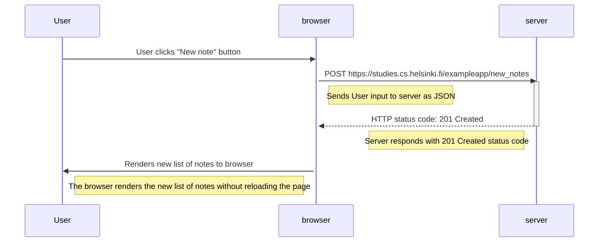

```mermaid
sequenceDiagram
    participant User
    participant browser
    participant server

    User->>browser: User clicks "New note" button
    activate browser
    browser->>server: POST https://studies.cs.helsinki.fi/exampleapp/new_notes
    activate server
    Note right of browser: Sends User input to server as JSON
    server-->>browser: HTTP status code: 201 Created
    deactivate server
    Note left of server: Server responds with 201 Created status code

    browser->>User: Renders new list of notes to browser
    Note left of browser: The browser renders the new list of notes without reloading the page


```
